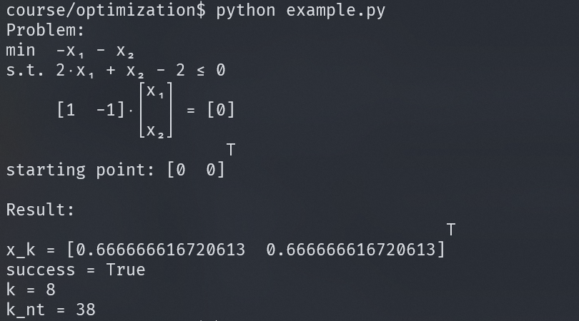

# Optimization Algorithm (USTC 2023 Spring, Yang Zhouwang)

# 最优化算法 (USTC 2023 春季学期, 杨周旺)

## Implemented algorithms

- inexact line search (Wolfe-Powell condition)
- backtracking line search
- sequential quadratic programming (SQP)
- newton's method with equality constraints
- barrier method

## Features

- Simple and clear interface
- Full `NumPy`-style docstrings and full type annotations
- Based on `Sympy`, thus support
    - automatic calculation of gradient and hessian
    - pretty printing of expressions

## Examples

There provides an example of solving inequality constrained convex optimization problem using barrier method in `example.py`. You can directly run it to see the result, or specify some parameters to see the effect of them.

```bash
usage: example.py [-h] [--problem {1,2}] [--t0 T0] [--mu MU] [--eps EPS] [--max_iter MAX_ITER]

Interior Point Method

options:
  -h, --help           show this help message and exit
  --problem {1,2}
  --t0 T0
  --mu MU
  --eps EPS
  --max_iter MAX_ITER
```

Here is a screenshot of the output by running `python example.py`.



For usage of other algorithms, please refer to the example given in their docstrings in the source code. Take `SQP` for example:

```python
def sqp(f: Callable[[Vec[Any]], Any], cons_eq: List[Callable[[Vec[Any]], Any]], cons_ineq: List[Callable[[Vec[Any]], Any]], x0: Vec[float], sigma: float = 0.4, eps: float = 1e-6, max_iter: int = 100) -> Tuple[Vec[float], bool, int]:
    """Solver for constrained optimization problem using Sequential Quadratic Programming (SQP) method.

    ```math
      min  f(x)
      s.t. c_i(x) = 0, i = 1,..., me
           c_i(x) <= 0, i = me+1,..., m
    ```

    Parameters
    ----------
    f : Callable[[Vec[Any]], Any]
        Objective function. It should return a sympy Expr object when receiving a Vec of sympy symbols as argument, where Expr should evaluate to a scalar when all symbols are substituted with numbers.
    cons_eq : List[Callable[[Vec[Any]], Any]]
        List of functions for equality constraints. Each function should return a sympy Expr object when receiving a Vec of sympy symbols as argument, where Expr should evaluate to a scalar when all symbols are substituted with numbers.
    cons_ineq : List[Callable[[Vec[Any]], Any]]
        List of functions for inequality constraints. Each function should return a sympy Expr object when receiving a Vec of sympy symbols as argument, where Expr should evaluate to a scalar when all symbols are substituted with numbers.
    x0 : Vec[float]
        Initial point.
    sigma : float, optional
        Coefficient of penalty function, by default 0.4.
    eps : float, optional
        Tolerance, by default 1e-6.
    max_iter : int, optional
        Maximum number of iterations, by default 100.

    Returns
    -------
    x_k : Vec[float]
        Optimal point if converged, otherwise the last point.
    success : bool
        Whether the algorithm successfully converged.
    k : int
        Number of iterations.

    Examples
    --------
    >>> obj_func = lambda x: x[0] ** 2 + x[1] ** 2
    >>> cons_eq = [lambda x: x[0] + x[1] - 1]
    >>> cons_ineq = []
    >>> x0 = [1.8, 1.7]
    >>> sqp(obj_func, cons_eq, cons_ineq, x0)
    (Matrix([
     [0.5],
     [0.5]]),
     True,
     1)
    """
```
